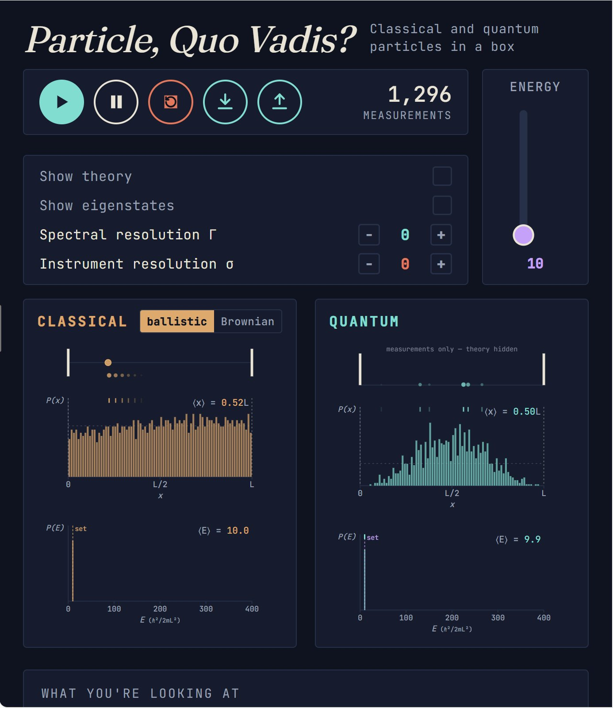

# Particle, Quo Vadis?

An interactive simulation comparing classical and quantum particles confined to a one-dimensional box. Built as a teaching tool for chemistry and physics students.

## What this teaches

Side-by-side, the same box contains two different particles:

- **A classical particle** — a localized ball, either ballistic (deterministic, bouncing off walls) or Brownian (random walk). Position is always definite. Energy is exactly the value you set.
- **A quantum particle** — described by a wavefunction. Position is probabilistic, measured one particle at a time. Energy is quantized: measurements return one of the eigenvalues $E_n = n^2 \pi^2 \hbar^2 / (2mL^2)$ with probabilities determined by how the state was prepared.

The simulation makes several abstract ideas tangible:

- **Quantization of energy** — sharp peaks at $E_n$ in the energy histogram emerge from the Born rule.
- **Measurement collapse** — each quantum measurement returns one eigenvalue; the distribution of repeated measurements reveals $|c_n|^2$.
- **Position vs energy uncertainty** — a quantum particle prepared at a definite $E$ has a delocalized position; a particle localized in position has indefinite energy.
- **Two sources of measurement spread** — intrinsic spectral width $\Gamma$ (a property of state preparation) vs. instrument resolution $\sigma$ (a property of the apparatus). At high $\sigma$, quantization becomes invisible — students see why high-resolution spectroscopy matters.
- **Classical-quantum contrast** — at the same energy, the classical particle samples positions uniformly; the quantum particle samples $|\psi(x)|^2$. The classical kinetic-energy "histogram" is a single sharp peak; the quantum energy histogram shows the underlying eigenvalue structure.

## Try it

The simulation is a single HTML page. Open [`index.html`](index.html) in any modern browser. No installation required.

If you'd like to deploy it for a class, see [Hosting](#hosting) below.

## How to use it

- **Energy slider** sets the target energy for state preparation.
- **Play / Pause** runs the simulation; **Stop** (red button) resets the histograms.
- **Show theory** overlays the analytical $|\psi(x)|^2$ on the position histogram and $|c_n|^2$ markers on the energy histogram.
- **Show eigenstates** marks the eigenvalues $E_n$ on the energy slider. Click an eigenstate label on the slider to snap the energy to that exact value.
- **Spectral resolution $\Gamma$** controls how broadly the prepared state spreads across eigenstates (Lorentzian width).
- **Instrument resolution $\sigma$** adds Gaussian noise to each energy measurement, modelling spectrometer finite resolution.
- **ballistic / Brownian** toggle (top right of the Classical panel) switches the classical particle's motion type.
- **Download** button (download arrow) exports the simulation state as CSV or JSON.
- **Upload** button (upload arrow) loads a previously saved JSON state.

Below the simulation, a small notes section ("What you're looking at") adapts to your current settings, summarising what the prepared state looks like and what the histograms should show.

The simulation automatically pauses every 10,000 measurements. Press Play to continue collecting.

## How it's built

- **One React component** in [`src/ParticleQuoVadis.js`](src/ParticleQuoVadis.js). All physics, UI, and export logic live here.
- **No build step required.** The HTML loads React via importmap, and Babel-standalone compiles the JSX in the browser at load time. This makes the source easy to read and modify — change the JSX, refresh the page, see the result.
- **Dependencies** are React 18 and Babel-standalone, both loaded from CDNs (esm.sh and unpkg). All three CDNs are stable and widely used in educational software.

If you want to fork and modify:

1. Open [`src/ParticleQuoVadis.js`](src/ParticleQuoVadis.js) in your editor.
2. Make changes.
3. Open [`index.html`](index.html) in your browser to test.
4. No `npm install` needed.

## Hosting

The simplest deployment is GitHub Pages:

1. Fork or clone this repository.
2. Go to **Settings → Pages**.
3. Set **Source** to "Deploy from a branch" → `main` / `/ (root)`.
4. After a minute, your students can use the simulation at `https://<your-username>.github.io/<repo-name>/`.

Any other static host (Netlify, Vercel, Cloudflare Pages, your university's web space) works the same way. The simulation is a single HTML file plus its source — nothing dynamic, no backend.

For local use, students can download the repository as a zip, extract it, and open `index.html` directly in their browser. Some browsers restrict ES modules loaded from `file://` URLs; if students hit this, host the files locally with a one-line static server (e.g. `python3 -m http.server` in the project folder).

## Pedagogical notes

The design choices behind this tool — units, default parameters, how the quantum and classical sides are made comparable, why the wall jitter exists, what the histograms actually report — are documented in [PEDAGOGY.md](PEDAGOGY.md). Worth reading if you plan to use this in a course or adapt it.

## Example states

The [`examples/`](examples/) folder contains a small set of saved simulation states demonstrating specific pedagogical points — quantization, the effect of spectral and instrumental broadening, off-eigenvalue preparation, and the contrast between ballistic and Brownian classical motion. Each example loads back into the app via the upload button. See [`examples/README.md`](examples/README.md) for a description of each example and a suggested teaching sequence.

## Cite this

If you use this tool in teaching or research, please cite it. GitHub renders a citation button from the [CITATION.cff](CITATION.cff) file; click "Cite this repository" near the top of the project page.

## License

- **Code** (the JSX, HTML, and any JavaScript) is licensed under the [MIT License](LICENSE).
- **Documentation and pedagogical materials** (this README, PEDAGOGY.md, screenshots, example data files) are licensed under [CC-BY-SA 4.0](LICENSE-docs).

You're free to use, modify, and redistribute under those terms.

## Contributions and feedback

Feedback from instructors and students is welcome. Open an issue if you find a bug, a pedagogical flaw, or have a suggestion. Pull requests welcome but please open an issue first to discuss.

This is a personal teaching project and not commercially supported. I'll respond as time allows.

## Acknowledgements

This simulation was developed iteratively in conversation with Claude (Anthropic). The physics, design choices, and pedagogical framing are mine; Claude implemented the code and helped reason through visualization and UX decisions.
